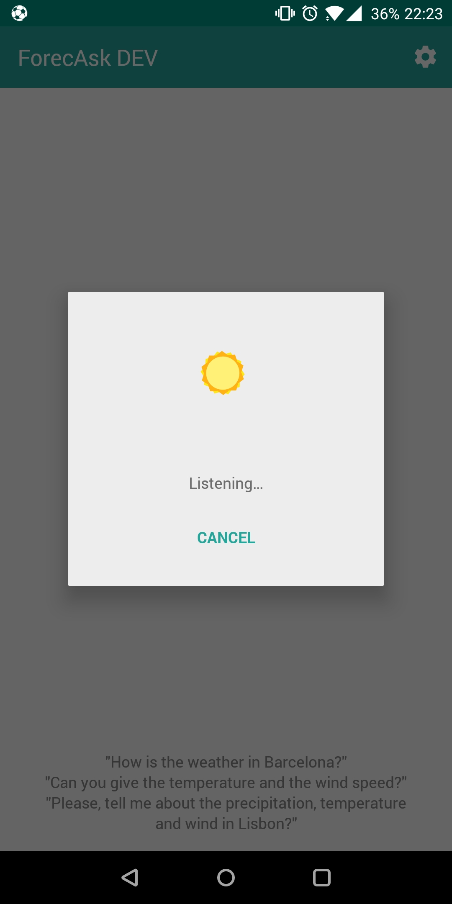
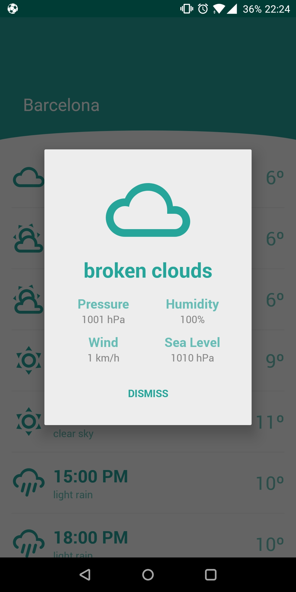
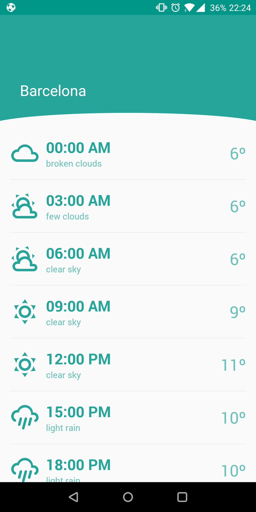

# ForecAsk

An android forecast assistant, developed in 24 hours.

## About

* A voice assistant that can get information about the weather for a specific place: temperature, pressure and precipitation
* Multi language support: English, Portuguese and Spanish
* Show information about the weather base on user location
* MVP Android Example used. (Need to add Dagger2)
* Language used: Kotlin
* Some of thelibraries used are developed by me (ADAL, AFM). For more information check my GitHub Page
* DialogFlow for natural human speech. (API.AI)

## Notes
* Please build appQA variant
* Don't forget to turn on the sound on your device :)
* You can add the widget to your Home screen. In this way you only need to unlock your phone and touch in the widget
* If you ask for a weather information without giving the location the app will try to get the user location

  
  
  
  
   

## License
[MIT LICENSE](LICENSE.md)
