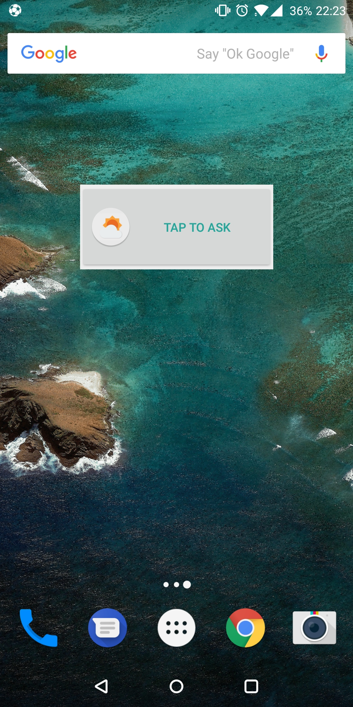

# ForecAsk

An android forecast assistant, develop in 24 hours.

## About

* Create an assistant to ask about the weather: temperature, pressure and precipitation.
* Show information about the weather base on location;
* MVP Android Example used. (Need to add Dagger2)
* Language used: Kotlin
* Some libraries used are developed by me (ADAL, AFM). For more information check my GitHub Page.

  
  
  
  
   

